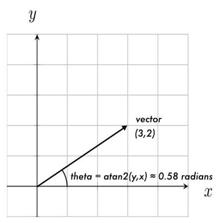

# ComputerGraphics2020

MEDIART 206: Computer Graphics - openFrameworks
    
Fall Session 2 2020     

Week 02 - Class 04


## Notes

[oFBook Code Examples GitHub](https://github.com/openframeworks/ofBook/tree/master/chapters)

## Issues, Bugs and Fixes

If you encounter errors with ofAppGlutWindow.h:

```
#include "ofMain.h"
#include "ofApp.h"
#include "ofAppGlutWindow.h"
 
//========================================================================
int main( ){
 
    ofAppGlutWindow window;
         ofSetupOpenGL(&window, 1024,768, OF_WINDOW);                    // <-------- setup the GL context
 
         // this kicks off the running of my app
         // can be OF_WINDOW or OF_FULLSCREEN
         // pass in width and height too:
         ofRunApp( new ofApp());
}
``` 

Modify the code to  this:

```
#include "ofMain.h"
#include "ofApp.h"
 
//========================================================================
int main( ){
         ofSetupOpenGL(1024,768, OF_WINDOW);                   // <-------- setup the GL context
 
         // this kicks off the running of my app
         // can be OF_WINDOW or OF_FULLSCREEN
         // pass in width and height too:
         ofRunApp( new ofApp());
}
 "
 ```
 
 Newer versions of oF and macOS break some of the older code.
## Homework

1. ### **Act Natural**

    For this sketch, you will create an animation that mimics some natural motion.  
    
    **First, choose your movement:**
    
    Observe the motion of the world around you - notice leaves blowing in the wind, or a cat wagging its tail. Find or shoot a quick video of the motion you want to simulate for reference.  On paper, draw the course of the motion over time.
    
    [Watch this short video for reference/inspiration.](https://www.youtube.com/watch?v=yzJk6ww3LD0)  
    
    **Then, model the motion in code:**
      
    In oF, create a scene, and animate an object or shape (or a group of them!) based on your motion.
    
    To achieve the animation, you should use functions like `sin()`, `cos()`, `ofNoise()`, `atan2()`, interpolation, `ofGetElapsedTimef()`, or other techniques of your choosing.  
    (Check out [Robert Penner](http://robertpenner.com/easing/)'s or [Golan Levin](http://www.flong.com/texts/code/shapers_exp/)'s [easing equations](http://easings.net/) for many more.)
      
    It may help to break down your motion into elements:
    
    - Are there aspects of the motion that oscillate (repeat) and aspects that don't?  
    `sin()` is a good choice for modelling the oscillating parts (`ball.x = sin(time)`)
     
    - Or maybe there are parts that are regular and predicatable, and parts that are more random?  
    `ofNoise()` is a good choice for random-ish behavior.
    
    
    **Make it interactive:**  
    Add an element of interactivity:  
    Perhaps mouse position affects the speed, or mouse click restarts the animation... get creative!


### Reading

- Re-read **[ofBook: Simulation chapter](http://openframeworks.cc/ofBook/chapters/animation.html#simulation)**
    
## Code Examples

- **Atan2** - calculate angle of motion using `atan2(vec.y,vec.x)`
- **Followers** - use atan2 to create an animated arrow
- **Mass** - bouncing balls using `Force = Mass x Acceleration`
- **NoiseGrid** - create a grid to draw noise as color over space and time
- **NoisyFollowers** - create a swarm of followers with noise-based positions
- **Oscillators** - drawing [Lissajous](https://en.wikipedia.org/wiki/Lissajous_curve)-like curves using `sin()` and `cos()`
- **SignalPlot** - plot `sin()`, modulating amplitude and frequency over time

## Review


### `ofNoise()`: Order in Chaos

**Noise** is a way of **smoothly randomizing** things.  
You can think of "noise" as a cloudy space, full of values ranging from 0.0 to 1.0.

You can access these values by inputting a set of coordinates in 1D, 2D, or 3D:

```c++
ofVec3f coords = ofVec3f(x,y,z);  // 3D noise
float noiseVal = ofNoise(coords); // returns 0.0 - 1.0
```

Under the hood, `ofNoise()` uses [Perlin noise](https://thebookofshaders.com/11/), a special noise function originally developed by Ken Perlin for CGI animation in the 1982 film _Tron_ (he won an Oscar for it!).


### Oscillation: `sin()` and `cos()`

When we want to model oscillating motion, we often use the C++ sine and cosine functions:  

```c++
float sine = sin(theta);
float cosine = cos(theta);
// theta is a float in radians, which wrap around at 0 and 2*PI (0º - 360º)
```

As `theta` increases, the return values smoothly oscillate between -1.0 and 1.0.  
In the diagram below, `theta` is shown in yellow.  


Note that the cosine wave is just the sine wave with an offset.

### Rotation: `atan2` (arctangent)

Recall that a vector has both a direction (angle of vector) and a magnitude (length of vector).  
We can calculate the angle of a vector using the C++ `atan2(y,x)` function:

```c++
ofVec2f vec = ofVec2f(3,2);
float angleRadians = atan2(vec.y, vec.x);   // note that y comes before x!
```


This allows us to model the angular rotation of objects, given a direction vector:

```c++
ofVec2f velocity = ofVec2f(3,2);    // our direction
float radians = atan2(velocity.x, velocity.y);     // direction angle
ofRotate(ofRadToDeg(rotation));     // ofRotate() takes angle in degrees
```

